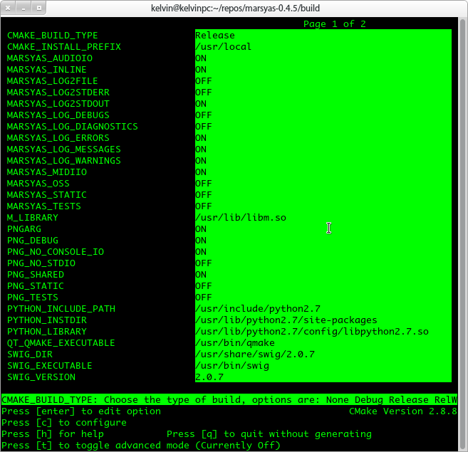
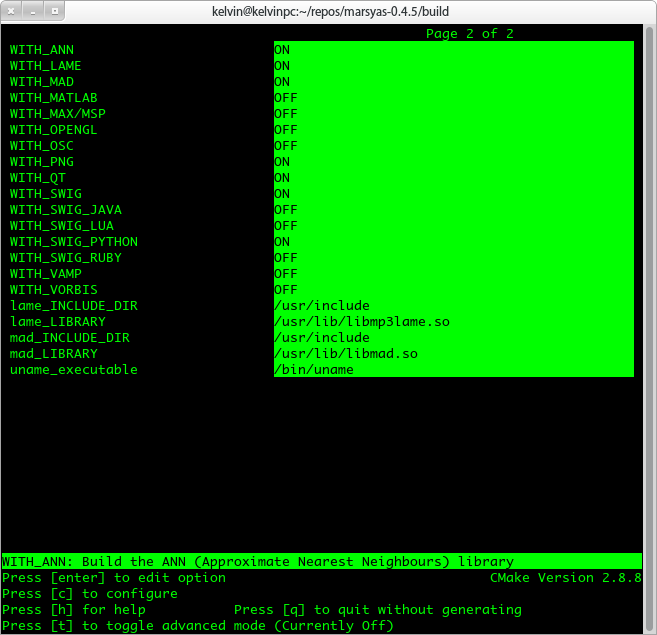



# 安装marsyas

*如果仅仅是运行二进制文件`MER_EX`，只需执行如下命令跳过本节内容。*

    sudo cp ./misc/libmarsyas.so /usr/lib/

* * * 

事先需要编译并安装[marsyas](http://sourceforge.net/projects/marsyas/ )，推荐版本0.4.5

## 可能需要的一些依赖

- libmad0-dev 
- qt4-dev-tools
- swig

## 配置marsyas

    $ cd marsyas-0.4.5
    $ mkdir build
    $ cd build
    $ ccmake ../src

ccmake 推荐配置

    $ make #若出错则按提示安装相应依赖库
    $ sudo make install

# 编译运行MER_EX

MER_EX依赖训练文件mc_train.arff，需保持其目录结构:

    .
    |-- MER_EX
    `-- resources
        |-- mc_train.arff
        |-- minitunes.png
        `-- single_.arff

编译运行

    $ cd build
    $ make
    $ ./MER_EX

# 其他

[Thayer's Model of Mood](https://www.google.com/search?q=Thayer's%20Model%20of%20Mood )

*说明文档完善中.  .  .  .  .  .最后更新 06/09/2012*
